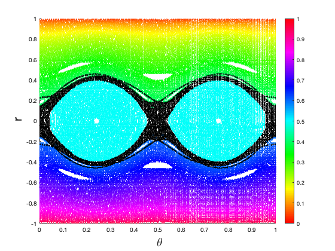
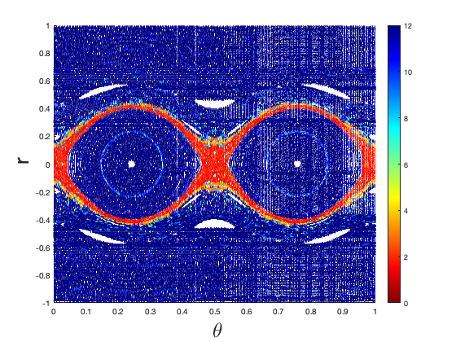

# Billiards Map

The goal of this code is to construct the billiard map for billiard tables that are perturbed ellipses. The output is the phase plot for the orbits on the table. 

<picture>

</picture>
